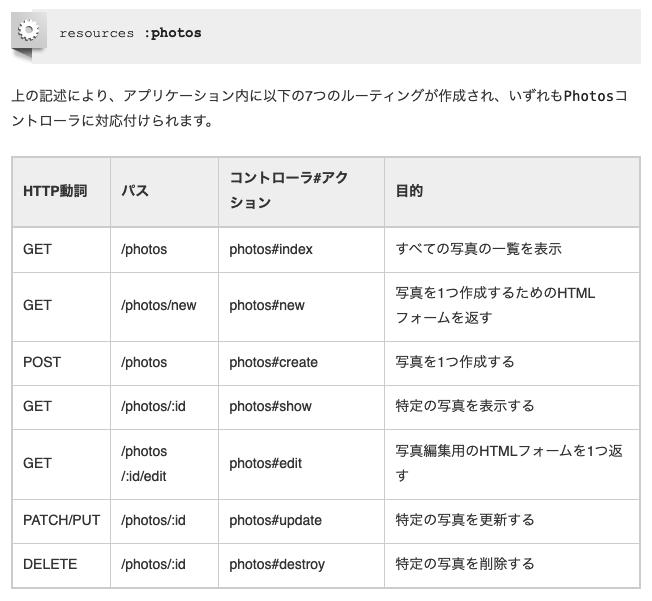

# Medley

## Rails

### Hello, Rails

controllerを作るとき、controllerとviewとテストとcssが作られる

```
$ rails g controller Facking unchi
Running via Spring preloader in process 6806
      create  app/controllers/facking_controller.rb
       route  get 'facking/unchi'
      invoke  erb
      create    app/views/facking
      create    app/views/facking/unchi.html.erb
      invoke  test_unit
      create    test/controllers/facking_controller_test.rb
      invoke  helper
      create    app/helpers/facking_helper.rb
      invoke    test_unit
      invoke  assets
      invoke    scss
      create      app/assets/stylesheets/facking.scss
```



`/photos` にアクセスしたとき、 `index.html.erb` があれば、そこにアクセスされる

- コントローラのアクションになれるのはpublicメソッドだけです。

- paramsメソッドは、フォームから送信されてきたパラメータ (つまりフォームのフィールド) を表すオブジェクトです。paramsメソッドはActionController::Parametersオブジェクトを返します。

- newメソッドのあと→createが呼ばれる(http://igarashikuniaki.net/rails_textbook/new-create.html)

- params[:article] == params.require(:article).permit(:title, :text)

```
controllerにて、上記のような記述をします。
.requireメソッドがデータのオブジェクト名を定め、
.permitメソッドで許可していない項目については変更されず、データの扱いがより安全になります。
```

- redirect_to @article --- モデルを保持している@articleを指定するだけで、そのモデルを表示するためのshowアクションにリダイレクトされる点にご注目ください。
- Railsではコントローラのインスタンス変数はすべてビューに渡されるようになっているからです (訳注: Railsはそのために背後でインスタンス変数をコントローラからビューに絶え間なくコピーし続けています)。
- `new_article_path`や`article_path(article)`は `routes`の`resources`が生成してくれる
- articles_pathヘルパーは、articlesという接頭語に関連付けられているURIパターンをフォームの送信先とするようRailsに指示します。そしてこのフォームはデフォルトに従ってPOSTリクエストとしてルーティングに送信されます。そしてこのルーティングは、現在のコントローラであるArticlesControllerのcreateアクションに関連付けられます。

- newが最初によばれ、新しい空のmodelを作り、viewに渡される。このときはエラーがないので、errors.any?はtrue。しかし、formから得たparamsではvalidation(modelのrb)に通らないので、エラーを持ったインスタンスが新たにviewに渡される。結果的に、以下のようなメモリで表示される

```
====In new====
#<Article:0x00007fc4ce3201f0>
=======
  Rendering articles/new.erb within layouts/application
=== in template ===
#<Article:0x00007fc4ce3201f0>

=== end template ===

====In create====
#<Article:0x00007fc4cbe737f8>
=======
  Rendering articles/new.erb within layouts/application
=== in template ===
#<Article:0x00007fc4cbe737f8>
```

- form_withメソッドの引数にはモデルオブジェクトを（model: @articleなどのような形で）渡せます。このときヘルパーはarticleオブジェクトに含まれているフィールドでフォームの項目を埋めます。scope: :articleのようにスコープにシンボルを指定すると、フィールドが空の状態で作成されます。
- form_withのmodelと(scope, url)の違いは？？

## 医療知識底上げ

### 1. 医療保険制度概要

- 医療機関: 医療診察を行うところ
- 診療所: 19床以下
- 病院: 20床以上。地域医療支援病院: 200床以上
- 調剤: 医師の通りにパッケージ化。
- 薬局: パッケージ化する場所
- 医薬分業: 医師と薬剤師を分けられてること
	- 特定薬局への誘導はダメ
- 医療保険
	- under 75: 社保(職場に勤めて、職務外の理由を対象)・国保(社保の対象外が加入する。自営業・農林業・自由業を対象)
	- over 75: 後期高齢者医療(寝たきり・障害者用)
- 労災保険・公費負担医療
- 患者・医療機関・保険者、以外に、支払機関が存在する(医療報酬の請求と支払をしてる)
- 被保険者証: 番号は仕事などでクラスタリングされてる
- 現物給付: 医療行為そのものを給付
- 現金給付: 出産手当金など医療に要した現金
- 給付率と患者負担は年齢によって変わる。赤ちゃんや高齢者が給付率高い
- 高額医療療費: 1ヶ月の患者負担費の合計がある人に給付される。基本的に現金給付
- 保険外併用療養費: 医療保険に認められて無くても、場合によっては認めてもらえる。評価療養(先進医療, etc)。選定療養(ベッド代、予約料)
- 1点=10円
- 公費負担医療: 法律や条例によって定められた対象者の診察・調剤
	- 公費単独: 全額負担
	- 医療保険との併用: 医療保管が負担し、患者の一部負担金を公費が負担する(患者が少し払う場合もあれば、全額負担される場合もある)
- 労災保険: 保険者は政府。対象者は労災保険に加入してる労働者。
	
### 2. 医療政策の仕組み

- 厚労省: 健康局、保健局などがある
- 政策: 自治体・患者・医療機関etc.が行政に主張をなげる
- 社会保障(100%)の内47%が年金、32%が医療。社会保障の負担は「保険料(60%)・税金(40%)」
- 高齢化がエグい	
- 地域によって高齢者の増え方が違う
- 少しずつ老人ホームで亡くなる人も増えてきてる
- 1あたりの受診数、病院数、病床数、CT、MRIの数は日本が多いけど、医者の数が少ない


### 4. 医療事務業務フロー概要

- CLINICSで賄っていることがわかる

### 5. 医療データ概要

- レセコン: 2年ごとの診療報酬改訂毎に公開される告示が点数マスタとしてのルートとなる。これらの告示を整理して会計システムとしてまとめ上げたもの
- ORCA: レセプト電算処理用コードを取り込み、マスタを構築し運用している
- レセコンは診療明細を取り込むため、病院、病気、薬などのデータも管理する必要がある

## 医療・調剤業務概論

### 医療事務基礎

- 病院の組織には{診療、看護、ジム、副医療}部門が存在する
- レセプトとは、診療報酬明細書。
- レセプトは、月極め請求、医療機関ごとに患者1人１件、厚生労働省の定めた形式で作る
- 診療報酬の計算は、個別出来高払いがある。
	- 基本診療料(診察したときに必ず払うもの）＋特掲診療料(注射、処置、手術など)
	- 初診料は「他に診療継続中の傷病が一つもない場合」に算定できる
	- 加算は「年齢・時間外etc」に算定できる
	- 再診料は「ある病気で２回目以降来たとき」に算定できる

### 投薬

- 処方：医者がどの程度、どの薬を投与すべきか考えること
- 投薬：処方したものを、薬剤師が実際作り渡すところまで
- 薬剤の種類・価格は厚生労働省が管理している
- 内用薬：飲み薬
- 内服薬：いつどれぐらい飲むが決まっているもの
- 頓服薬：症状が出てから飲む薬
- 外用薬：湿布・軟膏etc
- 危険な薬によって加算されたりもする。
- レセプトに書く欄がある

### 注射

- 注射: 薬剤(注射薬)を直接血管や患部に注入する方法
- 注射の難易度によって加算が変わる
- 薬剤料(1日分の点滴の合計)+実施料(1日1回の算定)
- レセプトに書く欄がある

### 処置

- 処置：患部を洗う、薬を塗る、ギプスをする、カテーテルで導尿するなど患者の身体の外部から手当をするもの全般のこと
- 処置 = 処置料(通則の加算 / 注の加算含む) + 処置医療機器等加算 + 薬剤料 + 特定保険医療材料費
- 処置料: 処置を行った技術料になる。各項目ごとに算出。
- 処置医療機器等加算: 腰・胸・頸部を固定するコルセット状のものを使用する(170点)
- 処置は大きく別けて10種類ある。一般処置(切り傷のガーゼ、熱傷処置)、救急処置(人工呼吸etc)、

## 医療データ論
